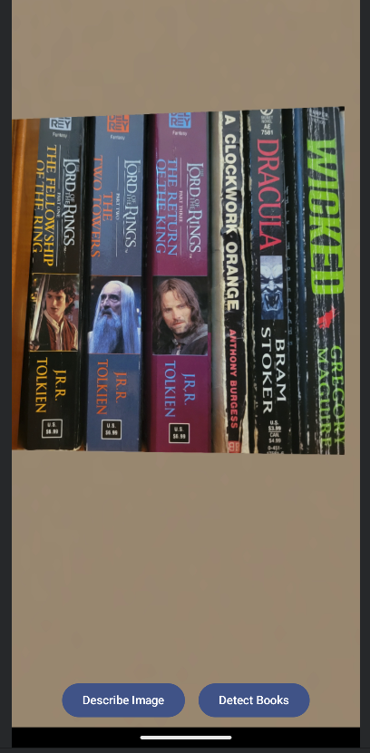
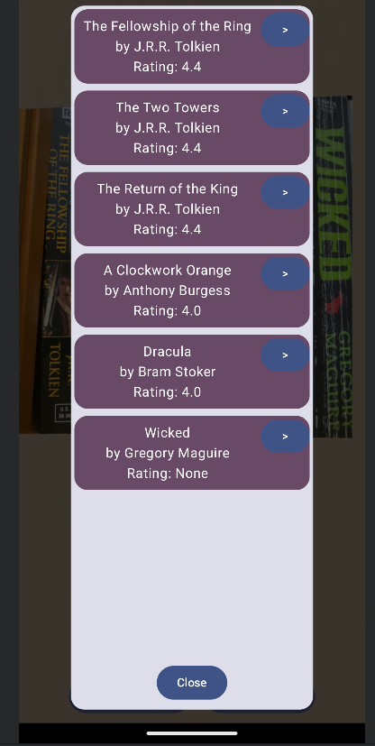
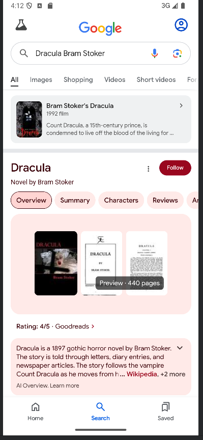

# BookScope

BookScope is a work-in-progress android app that takes an image from the camera and
attempts to recognize what books are present and look up their ratings.
It also provides a convenient way to do a web search for the detected books.

It uses the OpenAI API to recognize the books in the image and the OpenLibrary API to
look up the books' ratings.

The inspiration for this was when I am in a library or bookstore and wondering if any of
these books I see are any good.  I also thought it was a good way to learn about the OpenAI API.

## Setup

To build the app, you will need to provide an OpenAI API key.
Create a `apiKeys.properties` file in the root directory of the project and set its contents to:
```
OPENAI_API_KEY="sk-...your API key here..."
```

## Screenshots

Initial screen showing camera preview



After clicking the "Detect Books" button



After clicking the button on "Dracula" to do a web search



